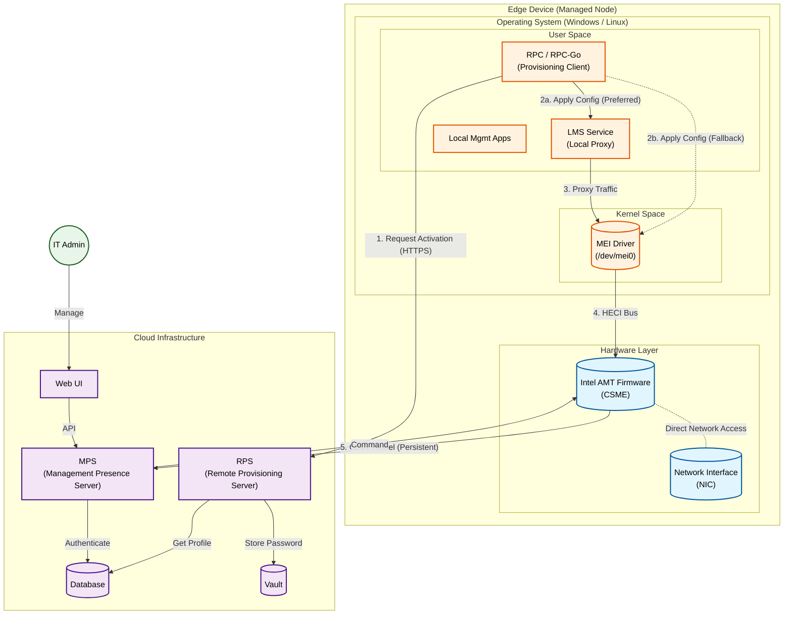

```mermaid
graph TD
    %% Styles
    classDef hardware fill:#e1f5fe,stroke:#01579b,stroke-width:2px,color:black;
    classDef software fill:#fff3e0,stroke:#e65100,stroke-width:2px,color:black;
    classDef cloud fill:#f3e5f5,stroke:#4a148c,stroke-width:2px,color:black;
    classDef user fill:#e8f5e9,stroke:#1b5e20,stroke-width:2px,color:black;

    subgraph "Edge Device (Managed Node)"
        subgraph "Hardware Layer"
            AMT[("Intel AMT Firmware<br>(CSME)")]:::hardware
            NIC[("Network Interface<br>(NIC)")]:::hardware
        end

        subgraph "Operating System (Windows / Linux)"
            subgraph "Kernel Space"
                MEI[("MEI Driver<br>(/dev/mei0)")]:::software
            end

            subgraph "User Space"
                RPC["RPC / RPC-Go<br>(Provisioning Client)"]:::software
                LMS["LMS Service<br>(Local Proxy)"]:::software
                LocalApp["Local Mgmt Apps"]:::software
            end
        end
    end

    subgraph "Cloud Infrastructure"
        MPS["MPS<br>(Management Presence Server)"]:::cloud
        RPS["RPS<br>(Remote Provisioning Server)"]:::cloud
        WebUI["Web UI"]:::cloud
        DB[("Database")]:::cloud
        Vault[("Vault")]:::cloud
    end

    User(("IT Admin")):::user

    %% 1. Provisioning Flow (Cloud Side)
    RPC -- "1. Request Activation (HTTPS)" --> RPS
    RPS -- "Get Profile" --> DB
    RPS -- "Store Password" --> Vault

    %% 2. Provisioning Flow (Local Side - The Correction)
    RPC -- "2a. Apply Config (Preferred)" --> LMS
    RPC -. "2b. Apply Config (Fallback)" .-> MEI
    
    %% 3. Hardware Access Path
    LMS -- "3. Proxy Traffic" --> MEI
    MEI -- "4. HECI Bus" --> AMT

    %% 4. CIRA Connection (Runtime)
    AMT -- "5. CIRA Tunnel (Persistent)" --> MPS
    MPS -- "Authenticate" --> DB
    
    %% 5. Management Flow
    User -- "Manage" --> WebUI
    WebUI -- "API" --> MPS
    MPS -- "Command" --> AMT

    %% Hardware Network Link
    AMT -. "Direct Network Access" .- NIC
```