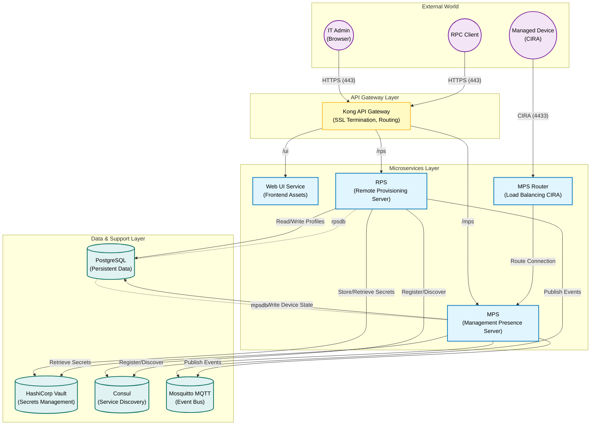

# Cloud Infrastructure Architecture

This diagram details the server-side components of the Open AMT Cloud Toolkit, showing how microservices, databases, and security components interact to provide management capabilities.

