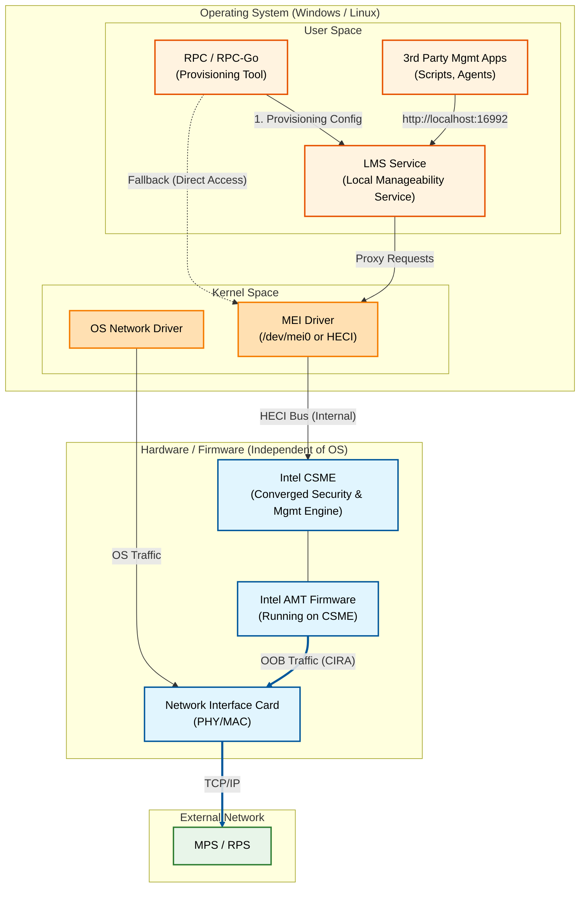

# Device Architecture (Edge Node)

This diagram illustrates the internal architecture of a managed device, highlighting the separation between the Operating System (OS) and the Hardware/Firmware (CSME), and how local components interact with Intel AMT.

## Key Concepts

### 1. User Space vs. Hardware
*   **User Space:** Where standard applications (like RPC) and services (like LMS) run. They depend on the OS being active.
*   **Hardware (CSME):** Where Intel AMT runs. It is a separate execution environment on the motherboard. It operates independently of the main CPU and OS.

### 2. The Role of MEI
The **MEI (Management Engine Interface)** driver is the only bridge between the OS and the Firmware. Software cannot "talk" to the firmware without passing through this driver.

### 3. The Role of LMS
**LMS** acts as a translator. It allows applications to use standard web protocols (HTTP/S) to talk to the firmware, which expects low-level HECI bus commands. This simplifies development for local management tools.

### 4. Out-of-Band (OOB) Networking
Notice that **Intel AMT** has a direct line to the **NIC**. This allows it to send and receive network packets (like the CIRA tunnel to the cloud) even if the **OS Network Driver** is crashed or the OS is missing entirely.
