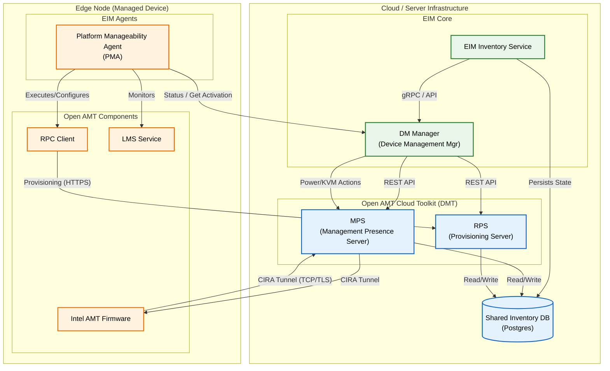

# EIM & Open AMT Integration Architecture

This document outlines the high-level integration between the Edge Infrastructure Manager (EIM) ecosystem and the Open AMT Cloud Toolkit (DMT). This integration enables EIM to leverage Intel vPro/AMT capabilities for out-of-band management of edge nodes.

## High-Level Architecture Diagram

## Integration Highlights

The integration bridges the general-purpose Edge Infrastructure Manager with the specialized hardware management capabilities of Intel AMT.

### 1. Cloud Side: DM Manager & Shared Inventory
*   **Shared Database:** A key architectural feature is the **Shared Inventory Database**. Instead of maintaining separate silos, the EIM Inventory, MPS, and RPS all share the same PostgreSQL database instance. This ensures a single source of truth for device state and credentials.
*   **DM Manager:** Serves as the **EIM-specific adapter** for the Open AMT Cloud Toolkit. It abstracts the complexity of raw MPS/RPS APIs and exposes a unified interface to the EIM Inventory Service.
*   **EIM Inventory Service:** The central management hub. It maintains the device list in the shared database and triggers management actions via the DM Manager.

### 2. Edge Side: Platform Manageability Agent (PMA)
*   **Role:** The `platform-manageability-agent` (PMA) is the critical EIM component running on the edge device.
*   **Function:**
    *   **Automation:** It automates the execution of the Remote Provisioning Client (RPC), removing the need for manual intervention.
    *   **Configuration Management:** It applies EIM-defined configurations to the local AMT stack.
    *   **Health Monitoring & Reporting:** It continuously monitors the health of the AMT stack (LMS, MEI) and **reports status directly to the DM Manager** via API calls. This ensures the cloud inventory is always aware of the edge device's manageability status.
    *   **Activation Request:** It communicates with the DM Manager to retrieve device activation requests and configuration details, triggering the provisioning process when instructed.

### 3. Unified Workflow
*   **Provisioning:** The Inventory Service triggers a provisioning workflow. The PMA on the device wakes up, runs RPC, and provisions the device against RPS.
*   **Management:** An administrator triggers an action in the EIM Console. The request flows: `Inventory Service` -> `DM Manager` -> `MPS` -> `CIRA Tunnel` -> `AMT Firmware`.
