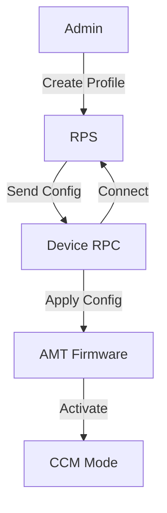
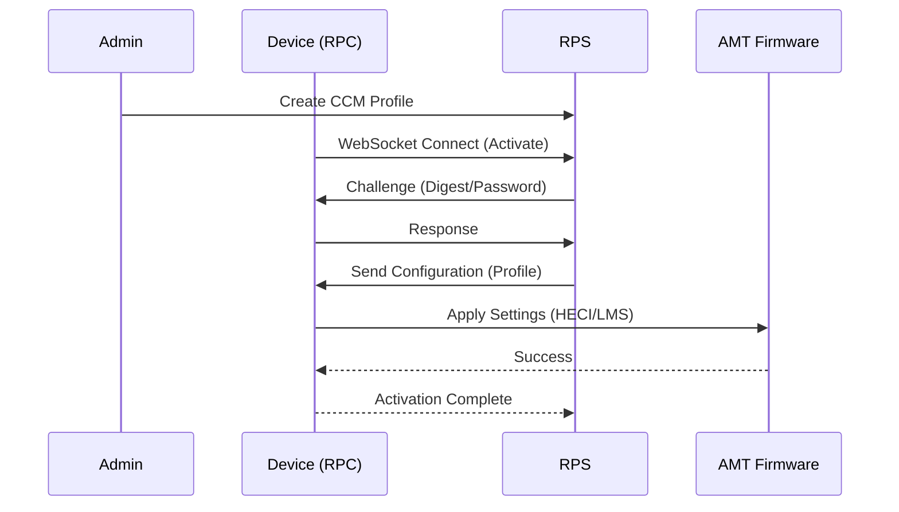
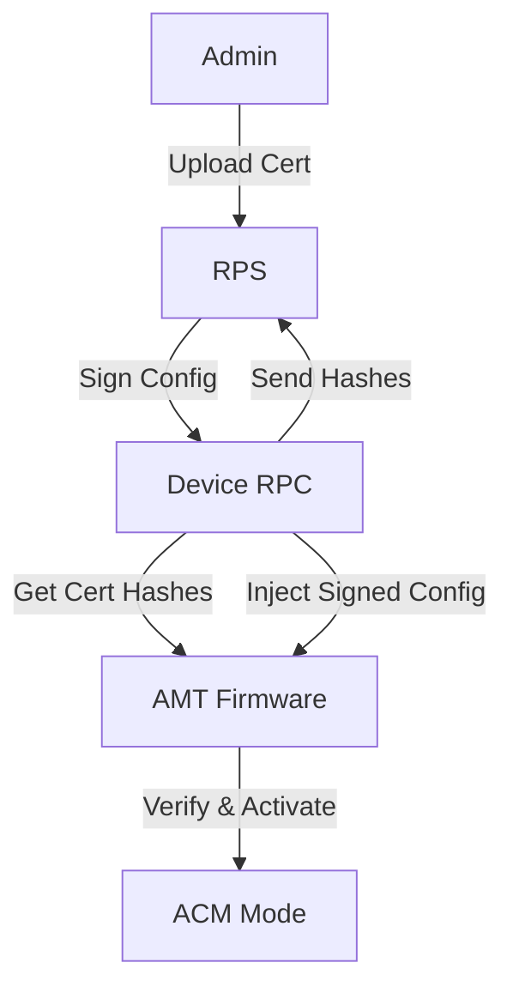
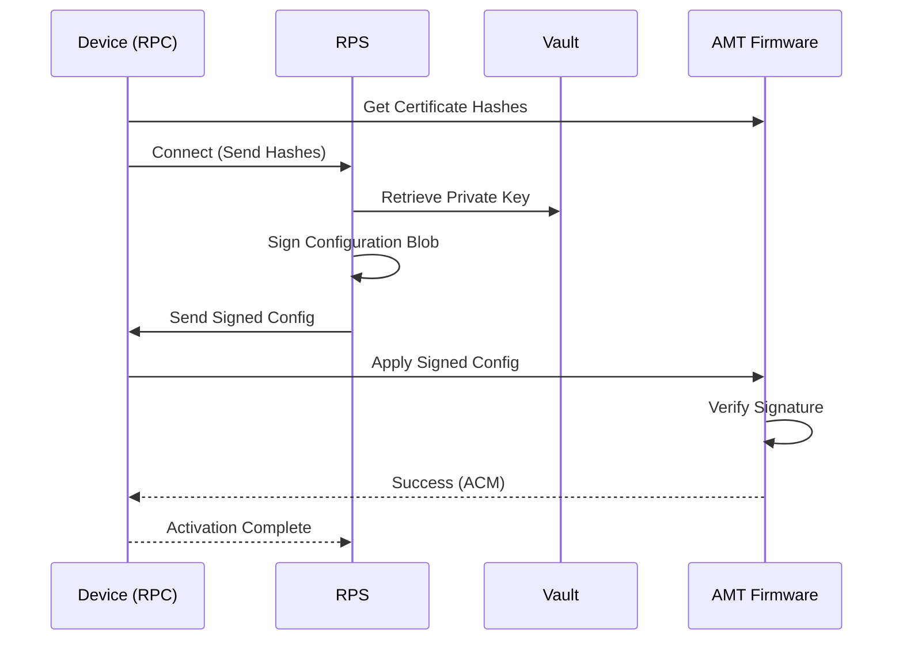

# Activation Modes (ACM & CCM)

## Overview
Activation is the process of configuring the Intel AMT firmware on a device to allow remote management. The Open AMT Cloud Toolkit supports two primary modes: **Client Control Mode (CCM)** and **Admin Control Mode (ACM)**.

## 1. Client Control Mode (CCM)
CCM is the default mode when no trusted certificate is present on the device or when activated via host-based provisioning without a certificate match. It requires User Consent (a 6-digit code on screen) for sensitive operations like KVM.

### Workflow Steps
1.  **Administrator** creates a CCM Profile in RPS.
2.  **Administrator** generates a CIRA Config (optional, but standard for cloud).
3.  **Device** runs the RPC (Remote Provisioning Client) tool.
4.  **RPC** connects to RPS and requests activation.
5.  **RPS** sends the configuration (password, network, CIRA).
6.  **RPC** applies the configuration to the local firmware via LMS/HECI.
7.  **Firmware** is activated in CCM.

### Workflow Diagram

### Sequence Diagram

---

## 2. Admin Control Mode (ACM)
ACM provides a higher level of trust. It requires a certificate hash in the AMT firmware that matches a certificate held by RPS. It allows KVM and other features without requiring User Consent.

### Workflow Steps
1.  **Administrator** uploads a Provisioning Certificate (PFX) to RPS (Vault).
2.  **Administrator** creates an ACM Profile in RPS.
3.  **Device** runs RPC.
4.  **RPC** connects to RPS.
5.  **RPS** detects the device's certificate hashes (in the Hello message).
6.  **RPS** signs the configuration using the matching private key.
7.  **RPC** injects the signed configuration into the firmware.
8.  **Firmware** verifies the signature and activates in ACM.

### Workflow Diagram

### Sequence Diagram

