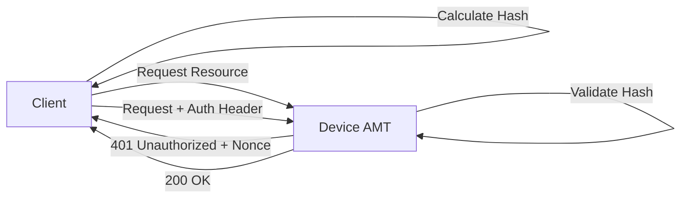
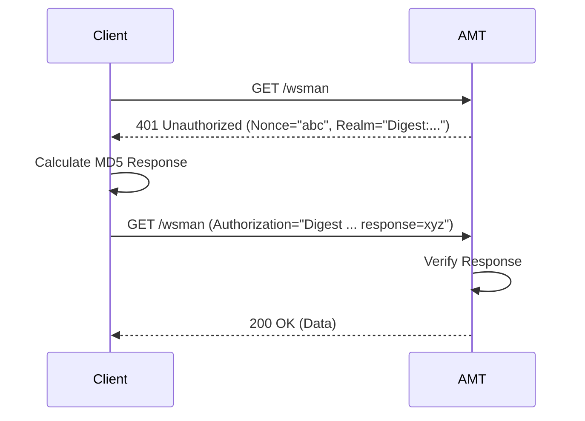

# Authentication: Digest Auth

## Overview
Intel AMT uses HTTP Digest Authentication (RFC 2617) for securing direct connections to the firmware (ports 16992/16993). This ensures that passwords are not sent in clear text over the network.

## Workflow Steps
1.  **Client** (MPS, Browser, or RPC) attempts to access a protected resource (e.g., `/wsman`).
2.  **Device** (AMT) responds with `401 Unauthorized` and includes a `WWW-Authenticate` header containing a `nonce`, `realm`, and `qop`.
3.  **Client** calculates the response hash:
    *   `HA1 = MD5(username:realm:password)`
    *   `HA2 = MD5(method:uri)`
    *   `Response = MD5(HA1:nonce:nc:cnonce:qop:HA2)`
4.  **Client** resends the request with an `Authorization` header containing the calculated response.
5.  **Device** validates the hash.
6.  **Device** grants access and returns `200 OK`.

## Workflow Diagram

## Sequence Diagram

