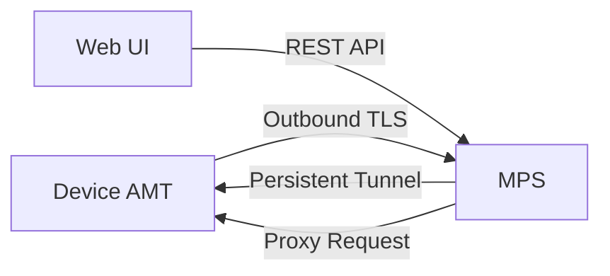
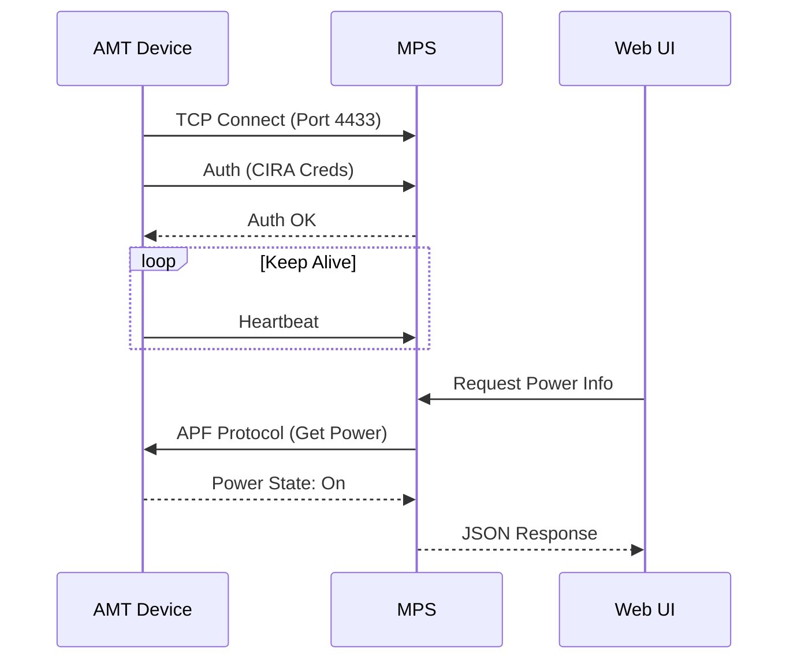
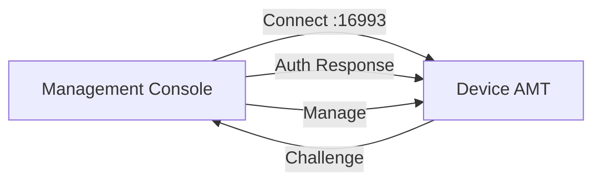
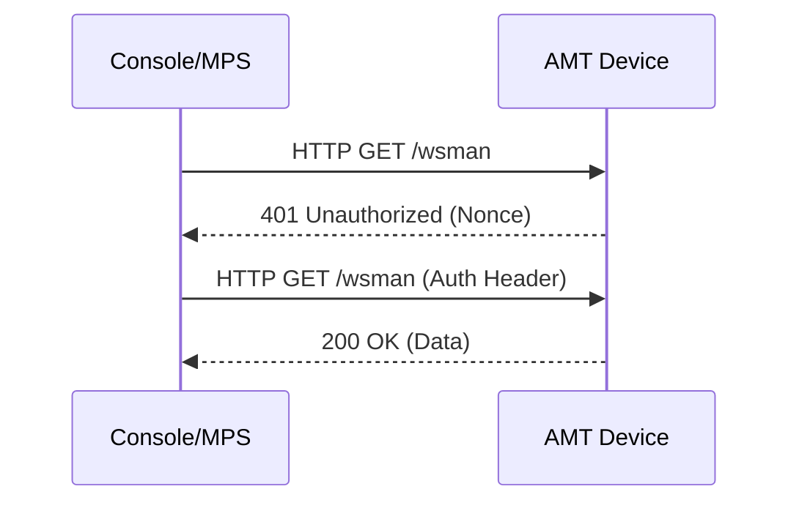

# Connectivity (CIRA & Direct Connect)

## Overview
Intel AMT devices can be managed via two primary connectivity methods: **CIRA (Client Initiated Remote Access)** for cloud/NAT environments, and **Direct Connect** for local/enterprise networks.

## 1. CIRA (Client Initiated Remote Access)
CIRA allows the device to establish a persistent, outbound TLS connection to the Management Presence Server (MPS). This enables management of devices behind firewalls or NATs without VPNs.

### Workflow Steps
1.  **Device** (AMT) boots up and loads the CIRA configuration (provisioned by RPS).
2.  **Device** initiates a TLS connection to the MPS server (port 4433).
3.  **MPS** authenticates the device (using the CIRA username/password).
4.  **MPS** holds the connection open (Keep-Alive).
5.  **User** (via Web UI) requests an action (e.g., Power On).
6.  **MPS** routes the request through the existing CIRA tunnel to the device.

### Workflow Diagram

### Sequence Diagram

---

## 2. Direct Connect (TLS/Non-TLS)
In a local network (LAN/VPN), the management server can connect directly to the device's IP address on port 16992 (Non-TLS) or 16993 (TLS).

### Workflow Steps
1.  **User** initiates a connection to the device IP.
2.  **Client** (Browser/MPS) performs a TCP handshake with the device.
3.  **Device** challenges the client (Digest Authentication).
4.  **Client** responds with the hashed password.
5.  **Device** grants access.
6.  **Client** sends WSMAN or Redirection commands.

### Workflow Diagram

### Sequence Diagram

