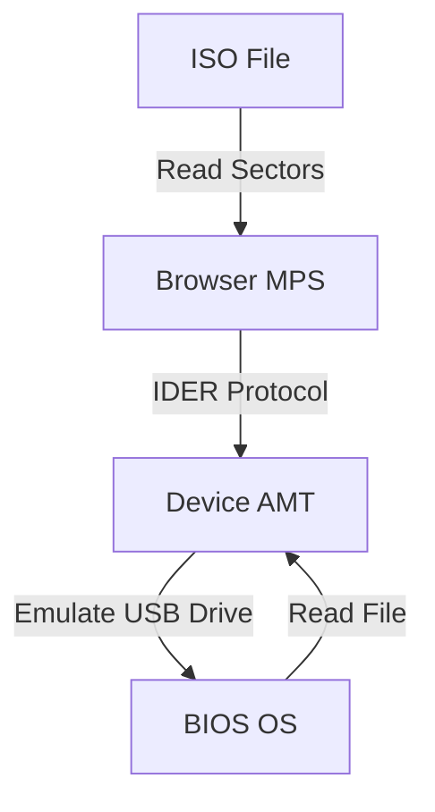
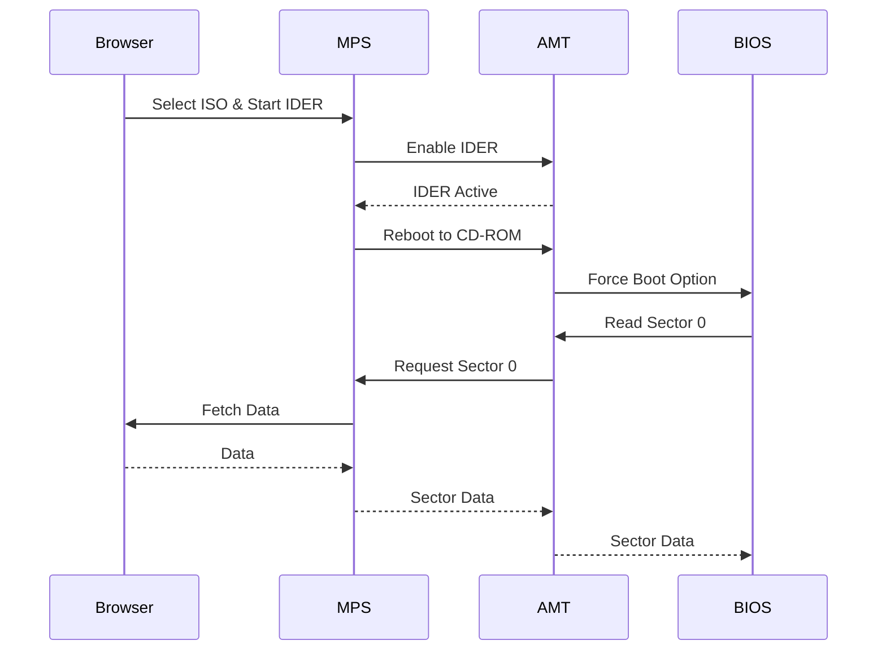

# IDER (IDE Redirection)

## Overview
IDE Redirection (IDER) allows a remote administrator to mount a local disk image (ISO, IMG, or floppy) to the managed device. The device sees this as a physical USB drive or CD-ROM attached to it. This is primarily used for remote OS installation, booting into recovery tools, or BIOS updates.

## Workflow Steps
1.  **User** selects a bootable ISO file in the Web UI.
2.  **Web UI** (or the MPS server) acts as the IDER Server, hosting the file.
3.  **MPS** sends a command to AMT to enable IDER redirection.
4.  **AMT** connects to the IDER channel.
5.  **Device** (BIOS/OS) detects a new storage device (Virtual CD-ROM).
6.  **User** triggers a reboot (often using Boot Control to force boot from CD-ROM).
7.  **BIOS** attempts to boot from the virtual drive.
8.  **AMT** intercepts the disk read requests from the BIOS.
9.  **AMT** forwards the read requests to MPS/Web UI.
10. **MPS/Web UI** reads the requested sectors from the ISO file and sends them back to AMT.

## Workflow Diagram

## Sequence Diagram

