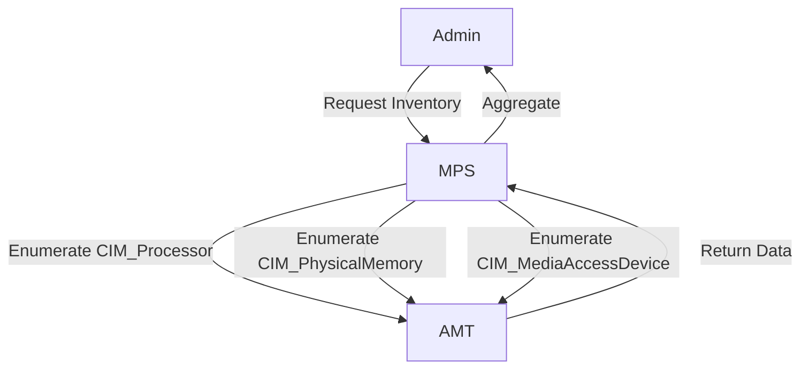
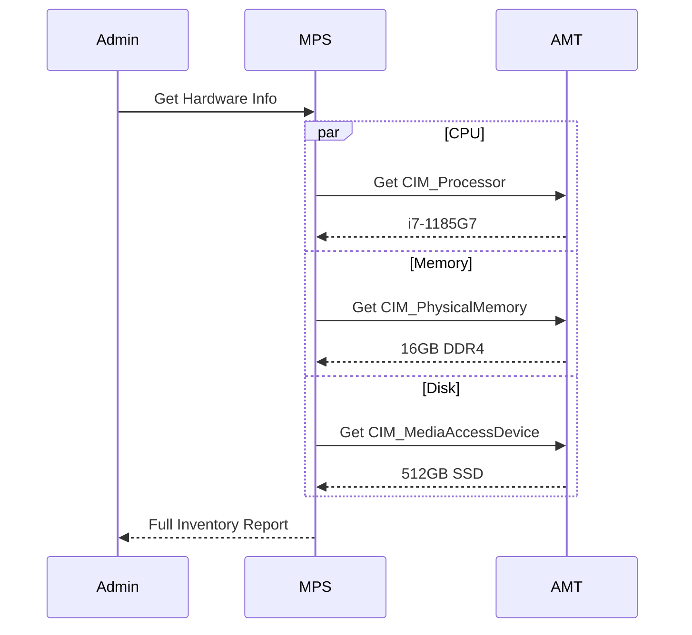
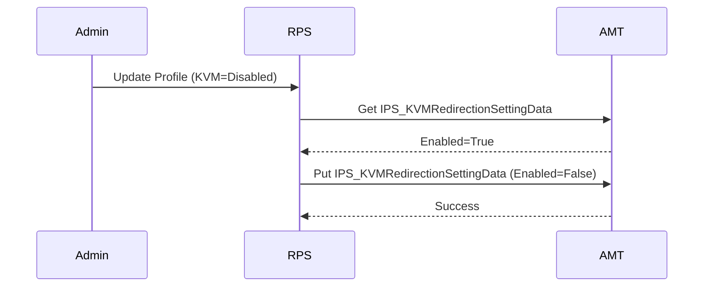

# Inventory & Management

## Overview
This section covers the retrieval of hardware asset information and the general configuration of AMT features.

## 1. Hardware Assets
AMT can query the hardware inventory even when the OS is powered off. This includes CPU, Memory, Disk, and BIOS information.

### Workflow Steps
1.  **Admin** requests Hardware Info.
2.  **MPS** sends WSMAN queries to various CIM classes:
    *   `CIM_Processor` (CPU model, speed)
    *   `CIM_PhysicalMemory` (RAM size, slots)
    *   `CIM_MediaAccessDevice` (Hard drives)
    *   `CIM_Card` (Motherboard info)
3.  **AMT** returns the data.
4.  **MPS** aggregates and returns a JSON object.

### Workflow Diagram

### Sequence Diagram

---

## 2. Configure AMT Features
Enabling or disabling specific AMT capabilities (e.g., KVM, SOL, IDER, Web UI) via the `AMT_RedirectionService` or `AMT_OptInService`.

### Workflow Steps
1.  **Admin** updates a profile to disable KVM.
2.  **RPS** connects to the device.
3.  **RPS** reads the current `ListenerEnabled` state of the KVM redirection service.
4.  **RPS** calls `RequestStateChange` to disable the service if needed.
5.  **AMT** updates the configuration.

### Sequence Diagram

