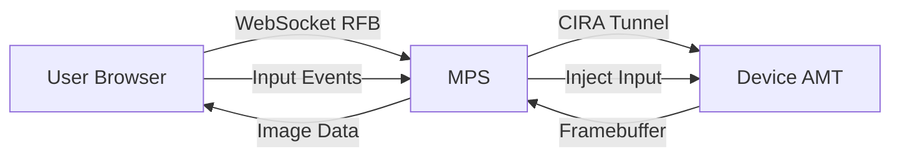
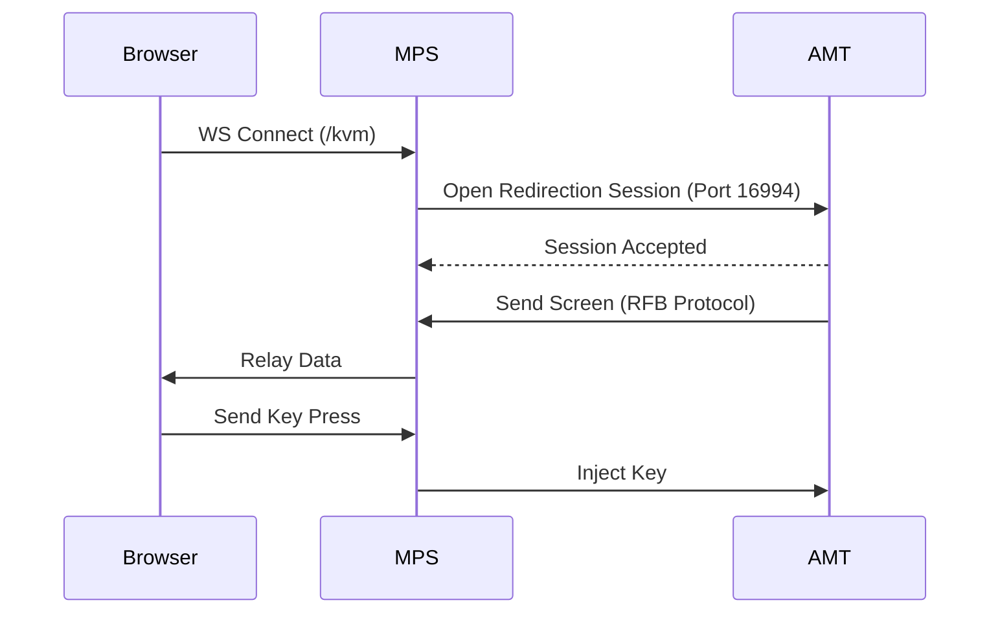

# KVM (Keyboard, Video, Mouse) Redirection

## Overview
KVM Redirection allows a remote administrator to view and control the display, keyboard, and mouse of the managed device. This works at the hardware level, allowing control even during boot (BIOS/UEFI) or OS failures (BSOD).

## Workflow Steps
1.  **User** initiates KVM session in the Web UI.
2.  **Web UI** establishes a WebSocket connection to the MPS server.
3.  **MPS** validates the session and checks if the device is connected via CIRA.
4.  **MPS** sends a redirection request to the device on port 16994.
5.  **Device** (AMT) accepts the connection (checking User Consent if required).
6.  **Device** starts sending framebuffer updates (RFB protocol) to MPS.
7.  **MPS** relays the RFB data to the Web UI.
8.  **Web UI** renders the screen on an HTML5 Canvas.
9.  **User** keystrokes and mouse events are captured by the UI and sent back to the device.

## Workflow Diagram

## Sequence Diagram

