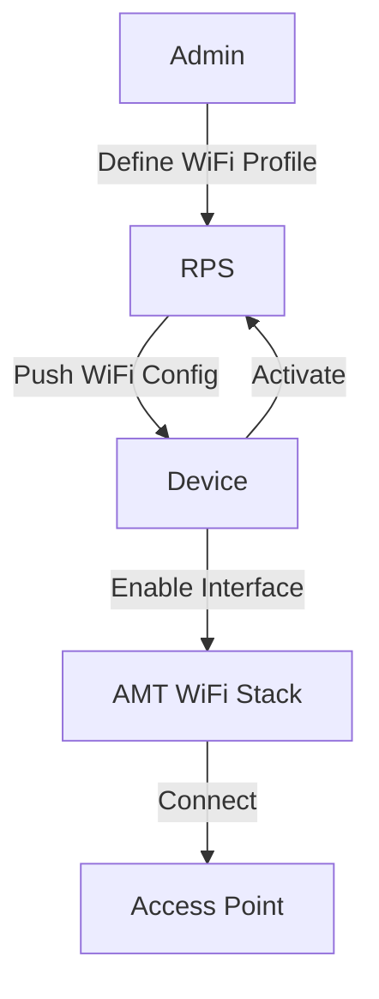
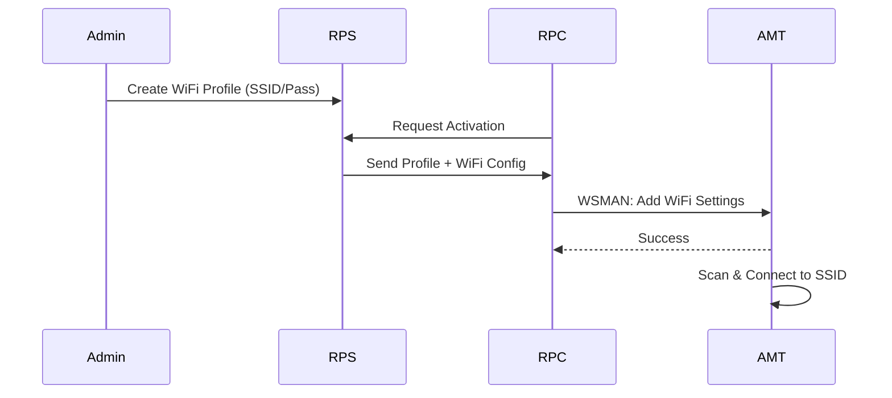
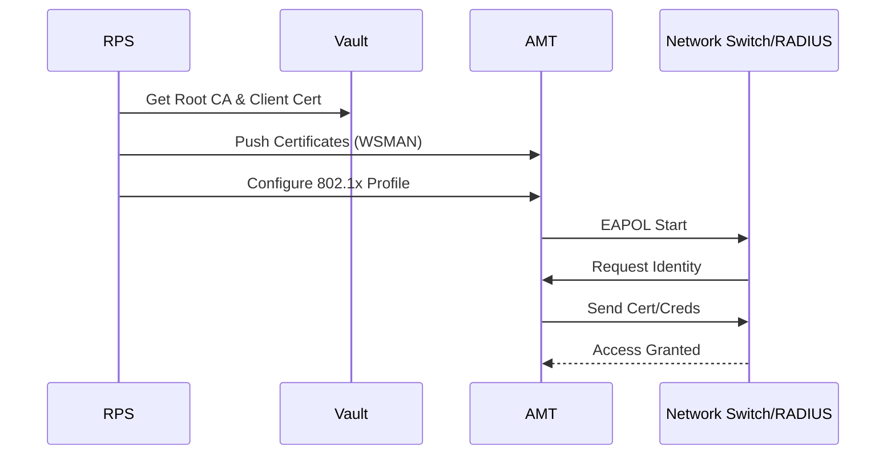

# Network Configuration

## Overview
Intel AMT shares the network interface with the host OS but maintains its own IP stack. It can be configured for Wired, Wireless, and 802.1x authentication.

## 1. Wired & Wireless Configuration
Network profiles define how AMT obtains an IP (DHCP or Static) and, for wireless, the SSID and passphrase.

### Workflow Steps
1.  **Administrator** defines a Network Profile in RPS (Wired or WiFi).
2.  **Administrator** associates the Network Profile with a Provisioning Profile.
3.  **Device** activates via RPC.
4.  **RPS** sends the WiFi configuration (if applicable) to the device.
5.  **AMT** enables the WiFi interface and attempts to associate with the AP.
6.  **Note**: WiFi requires the host OS to be running initially to sync profiles, or AMT must be in S0/S1 state to maintain connection, depending on power policies.

### Workflow Diagram

### Sequence Diagram

---

## 2. IEEE 802.1x Authentication
For enterprise networks requiring 802.1x (EAP-TLS, PEAP, etc.), AMT needs root certificates and client certificates.

### Workflow Steps
1.  **Administrator** uploads the Root CA certificate to RPS (Vault).
2.  **Administrator** creates an 802.1x Profile (selecting EAP type).
3.  **Device** activates.
4.  **RPS** pushes the Root CA and generates/pushes a client certificate (if EAP-TLS) to AMT.
5.  **AMT** uses these credentials to authenticate with the RADIUS server/Switch.

### Sequence Diagram

