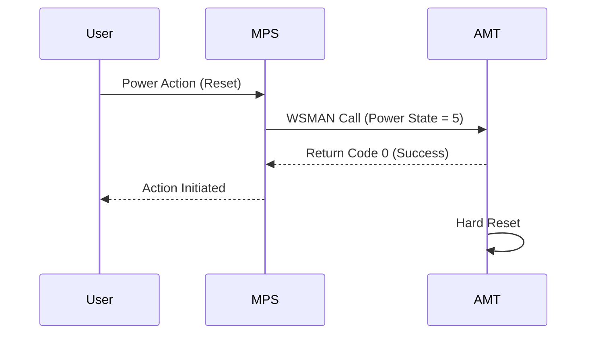
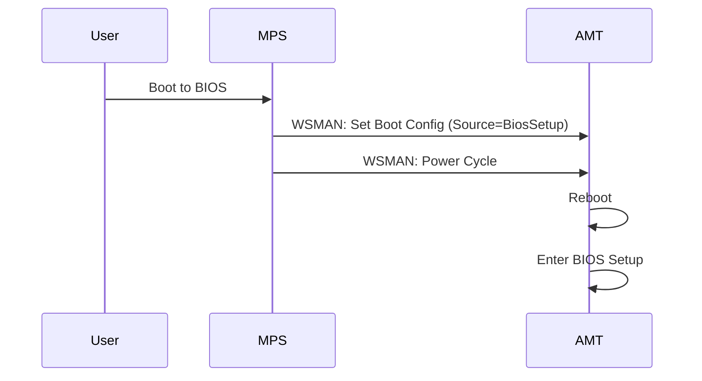

# Power & Boot Control

## Overview
One of the most fundamental features of Intel AMT is the ability to control the power state of the device (On, Off, Reset, Cycle) and configure the boot order (e.g., boot to PXE, BIOS, or a virtual CD-ROM) regardless of the OS state.

## 1. Power Control
Allows remote power cycling of the device.

### Workflow Steps
1.  **User** selects a power action (e.g., "Power On") in the Web UI.
2.  **Web UI** sends a REST request to MPS.
3.  **MPS** translates the request into an AMT WSMAN command (`CIM_PowerManagementService.RequestPowerStateChange`).
4.  **MPS** sends the command through the CIRA tunnel.
5.  **AMT** receives the command and triggers the hardware power controller.
6.  **Device** changes power state.

### Workflow Diagram

### Sequence Diagram

---

## 2. Boot Control (IDER/PXE)
Allows setting the boot device for the *next* boot cycle.

### Workflow Steps
1.  **User** selects "Boot to BIOS" or "Boot to CD-ROM" (IDER).
2.  **Web UI** sends a request to MPS.
3.  **MPS** sends WSMAN commands to:
    *   Enable `CIM_BootConfigSetting`.
    *   Set `BootSourceOverrideTarget` (e.g., `Cdrom`, `BiosSetup`).
    *   Set `FirmwareVerbosity` (optional).
4.  **MPS** sends a Power Cycle command.
5.  **Device** reboots and follows the override.

### Sequence Diagram

## 3. Alarm Clocks
Allows scheduling a wake-up time for the device.

### Workflow Steps
1.  **User** sets a wake-up time.
2.  **MPS** calls `AddAlarm` on the `IPS_AlarmClockOccurrence` service.
3.  **AMT** stores the alarm.
4.  **Device** wakes up at the scheduled time.
