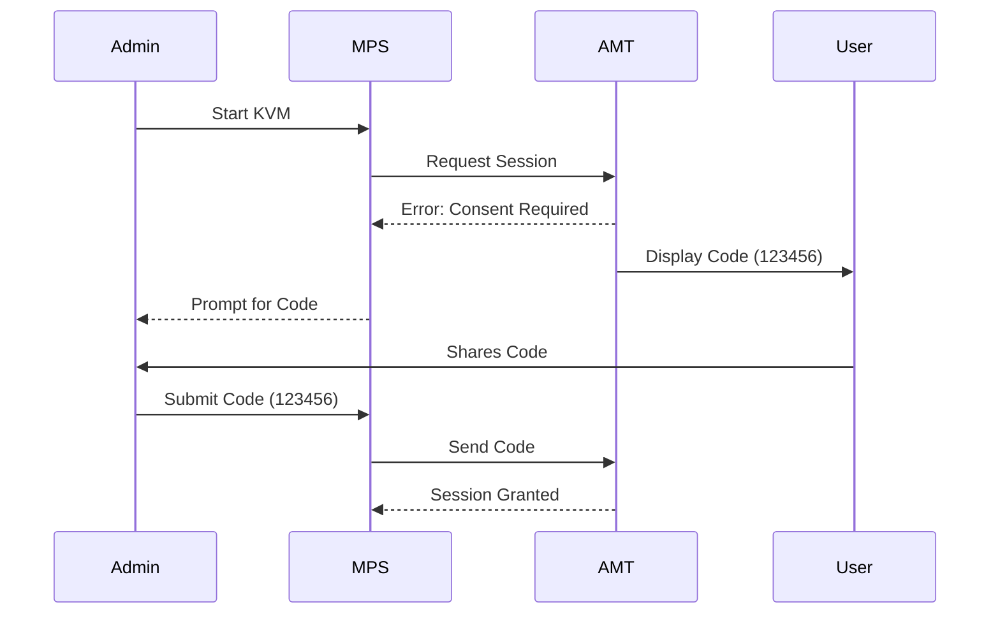
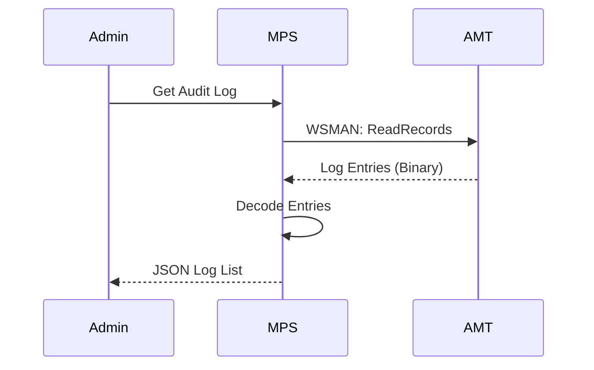

# Security & Compliance

## Overview
This section covers security features including User Consent, Certificate Management, and Audit Logging.

## 1. User Consent
User Consent is a security feature that requires a person physically present at the device to approve a remote KVM or SOL session by reading a 6-digit code displayed on the screen. It is mandatory in Client Control Mode (CCM) and optional in Admin Control Mode (ACM).

### Workflow Steps
1.  **Admin** requests KVM session.
2.  **AMT** checks the User Consent policy (e.g., `UserConsentPolicy = 1`).
3.  **AMT** generates a random 6-digit code and overlays it on the screen (Sprite).
4.  **Admin** is prompted in the Web UI to enter the code.
5.  **User** (at device) reads the code to the Admin (via phone/chat).
6.  **Admin** enters the code.
7.  **MPS** sends the code to AMT.
8.  **AMT** validates and opens the KVM session.

### Sequence Diagram

---

## 2. Certificates: Get/Add
Managing trusted root certificates and the device's own identity certificate.

### Workflow Steps (Add Certificate)
1.  **Admin** selects a certificate in RPS.
2.  **RPS** connects to AMT.
3.  **RPS** calls `AMT_PublicKeyManagementService.AddTrustedRootCertificate`.
4.  **AMT** stores the certificate in non-volatile memory.

### Workflow Steps (Get Certificates)
1.  **Admin** views device details.
2.  **RPS** calls `AMT_PublicKeyManagementService.GetTrustedRootCertificates`.
3.  **AMT** returns the list of hashes/subjects.

---

## 3. Event & Audit Logs
AMT maintains an internal Event Log (hardware events) and an Audit Log (security events, e.g., who logged in, what settings changed).

### Workflow Steps
1.  **Admin** requests logs.
2.  **MPS** calls `AMT_AuditLog.ReadRecords`.
3.  **AMT** returns the binary log data.
4.  **MPS** decodes the log entries into readable text.
5.  **MPS** displays them to the user.

### Sequence Diagram

