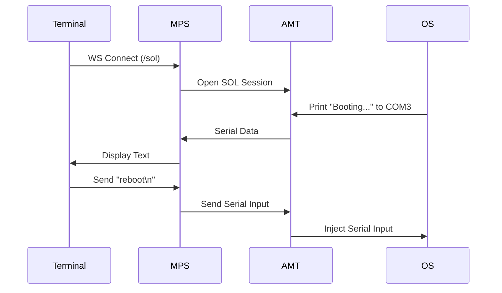

# SOL (Serial Over LAN)

## Overview
Serial Over LAN (SOL) provides a bidirectional text-based serial console redirection. It allows administrators to interact with the device's serial port remotely, which is useful for headless servers, Linux console access, or viewing BIOS boot logs.

## Workflow Steps
1.  **User** opens the Terminal in the Web UI.
2.  **Web UI** establishes a WebSocket connection to the MPS server.
3.  **MPS** connects to the SOL interface on the device (Port 16994).
4.  **OS Configuration**: The operating system (Linux/Windows) must be configured to redirect its console output to the AMT Serial Port (typically COM3 or ttyS0).
5.  **AMT** captures the serial output from the OS/Hardware.
6.  **AMT** encapsulates the serial data in SOL packets and sends them to MPS.
7.  **MPS** forwards the text data to the Web UI.
8.  **Web UI** displays the text in a terminal emulator (e.g., xterm.js).

## Workflow Diagram

## Sequence Diagram

