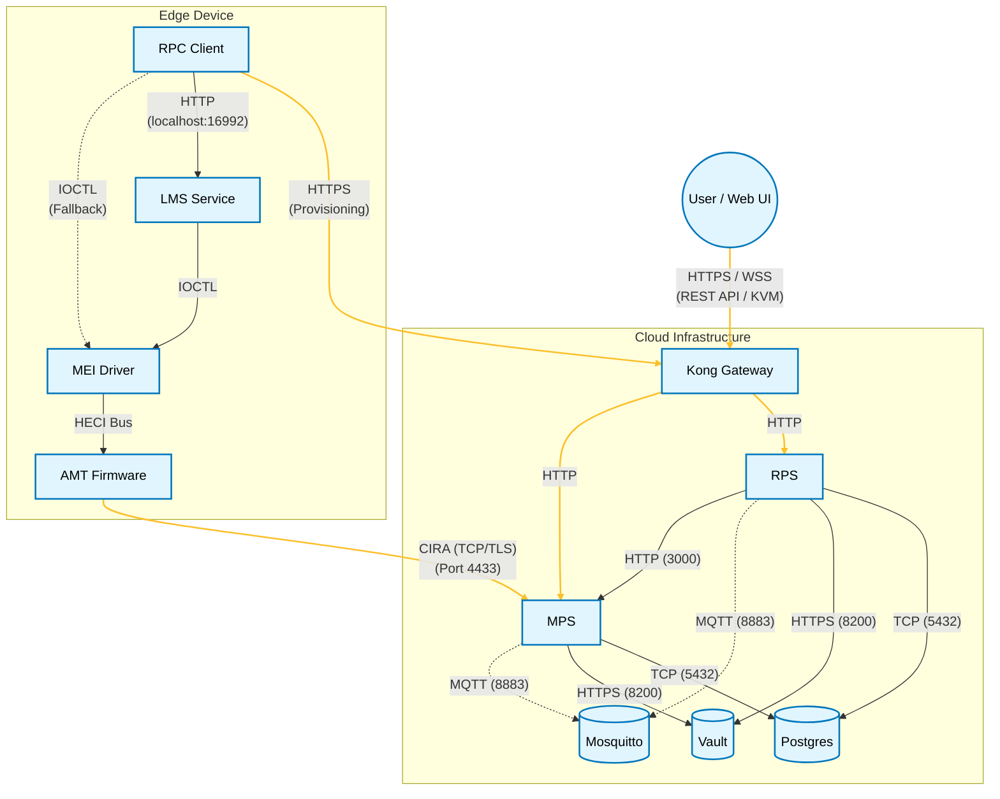

# Interface & Protocol Documentation

This document outlines the communication protocols and API types used between the various components of the Open AMT Cloud Toolkit ecosystem, as well as the interfaces exposed to end-users.

## Interface Diagram

## Summary of Interfaces

| Source Component | Destination Component | Protocol / Interface | Description |
| :--- | :--- | :--- | :--- |
| **RPC (Client)** | **RPS (Server)** | HTTPS (REST) | Activation request, profile retrieval. |
| **RPC (Client)** | **LMS (Service)** | HTTP (REST/SOAP) | Local configuration commands sent to `localhost:16992`. |
| **RPC (Client)** | **MEI (Driver)** | IOCTL / Syscall | Direct kernel driver calls (fallback if LMS is absent). |
| **LMS (Service)** | **MEI (Driver)** | IOCTL / Syscall | Proxies local traffic to the firmware driver. |
| **MEI (Driver)** | **AMT Firmware** | HECI Bus | Hardware-level bus communication. |
| **AMT Firmware** | **MPS (Server)** | CIRA (TCP/TLS) | Persistent "Call Home" tunnel for OOB management. |
| **Web UI (Browser)** | **Kong (Gateway)** | HTTPS (REST) | User actions (power control, KVM) and data retrieval. |
| **Kong (Gateway)** | **MPS / RPS** | HTTP / HTTPS | Reverse proxy routing to microservices. |
| **MPS / RPS** | **PostgreSQL** | TCP (Postgres) | Persistent storage for devices and profiles. |
| **MPS / RPS** | **Vault** | HTTPS (REST) | Storage and retrieval of sensitive secrets. |
| **MPS / RPS** | **Mosquitto** | MQTT (TCP) | Asynchronous event publishing. |
| **RPS (Server)** | **MPS (Server)** | HTTP (REST) | Notification of device updates (e.g., password changes). |

---

## 1. Cloud Interfaces (Northbound)

These interfaces are exposed to IT Administrators and external systems.

### REST APIs (via Kong Gateway)
All external REST traffic is routed through the Kong API Gateway, typically on port `443` (HTTPS).

*   **RPS API (`/rps`)**
    *   **Type:** RESTful JSON
    *   **Usage:** Managing provisioning profiles, domains, and CIRA configs.
    *   **Key Endpoints:**
        *   `GET /api/v1/admin/profiles`: List all provisioning profiles.
        *   `POST /api/v1/admin/domains`: Add a new domain.
*   **MPS API (`/mps`)**
    *   **Type:** RESTful JSON
    *   **Usage:** Executing management actions on connected devices.
    *   **Key Endpoints:**
        *   `GET /api/v1/devices`: List connected devices.
        *   `POST /api/v1/amt/power/action`: Send power commands (On, Off, Reset).
        *   `GET /api/v1/amt/kvm/connect`: Initiate a KVM session (often upgraded to WebSocket).

### WebSockets
*   **KVM & Serial-over-LAN (SOL)**
    *   **Protocol:** WSS (Secure WebSockets)
    *   **Usage:** Provides real-time, bidirectional streams for remote desktop control (KVM) and terminal access (SOL). The Web UI connects to MPS via WebSocket, and MPS tunnels this traffic through the CIRA connection to the device.

---

## 2. Device-to-Cloud Interfaces (Southbound)

These interfaces connect the managed edge devices to the cloud infrastructure.

### CIRA (Client Initiated Remote Access)
*   **Protocol:** Intel proprietary protocol over TCP (often wrapped in TLS).
*   **Port:** Default `4433` (exposed by MPS Router/MPS).
*   **Description:** A persistent, keep-alive connection initiated by the AMT Firmware.
*   **Function:**
    *   Allows the server to reach the device even if the device is behind a NAT or firewall.
    *   Tunnels management traffic (APF - AMT Port Forwarding) from the server to the firmware.

### Provisioning Protocol
*   **Protocol:** HTTPS (REST)
*   **Description:** The RPC tool communicates with RPS to "activate" the device.
*   **Payload:** JSON containing the activation nonce, certificate hashes, and device capabilities.

---

## 3. Local Device Interfaces

These interfaces operate strictly within the managed device's Operating System and Hardware.

### LMS Interface
*   **Protocol:** HTTP
*   **Address:** `http://localhost:16992`
*   **Description:** LMS exposes the AMT WSMAN (Web Services Management) interface locally.
*   **Usage:** Local scripts or the RPC tool send SOAP/WSMAN messages to this port. LMS strips the HTTP headers and passes the payload to the driver.

### HECI (Host Embedded Controller Interface)
*   **Type:** Hardware Bus Protocol
*   **Description:** The physical and logical interface between the host OS (via the MEI driver) and the CSME firmware.
*   **Usage:** Transmits low-level messages. It is not a network protocol; it is a memory-mapped interface.

---

## 4. Infrastructure Interfaces (East-West)

These interfaces are used for communication between the microservices within the cloud environment.

*   **Database Connection:** Standard PostgreSQL TCP connection (default port `5432`).
*   **Secrets Management:** REST API calls to HashiCorp Vault (default port `8200`).
*   **Service Discovery:** HTTP/DNS queries to Consul (default port `8500`).
*   **Event Bus:** MQTT protocol to Mosquitto (default port `1883` or `8883` for TLS).
*   **RPS to MPS:** HTTP REST calls (default port `3000`).
    *   **Usage:** RPS notifies MPS of critical device changes, such as password updates or device deletions, to ensure MPS has the latest credentials for management actions.

